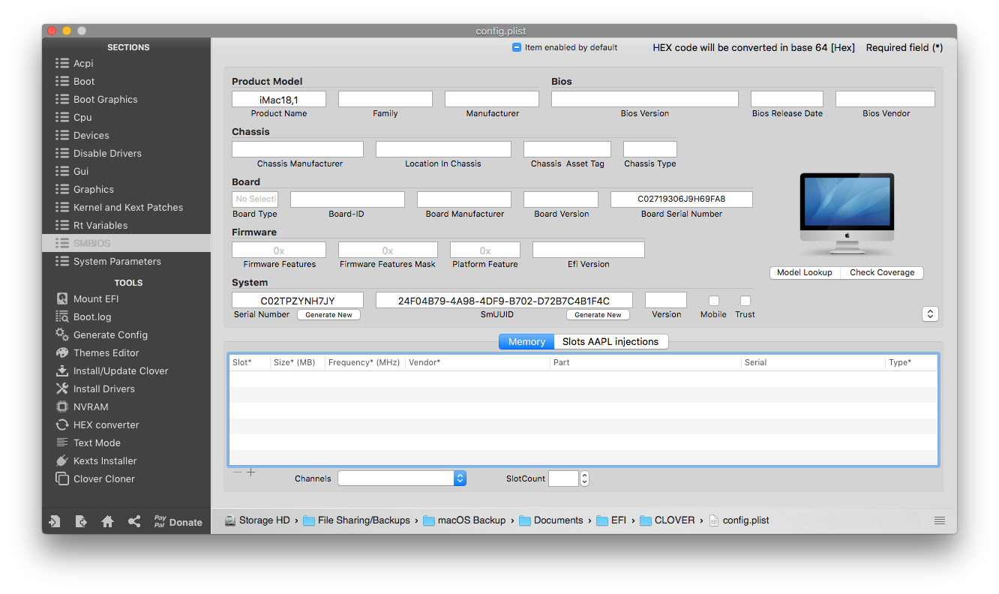

# Lets get this to work.

## Deleting old attempts

This is a easy way to do it.

Open Terminal

and run this command

```
sudo rm -rf ~/Library/Caches/com.apple.iCloudHelper* \
            ~/Library/Caches/com.apple.Messages* \
            ~/Library/Caches/com.apple.imfoundation.IMRemoteURLConnectionAgent* \
            ~/Library/Preferences/com.apple.iChat* \
            ~/Library/Preferences/com.apple.icloud* \
            ~/Library/Preferences/com.apple.imagent* \
            ~/Library/Preferences/com.apple.imessage* \
            ~/Library/Preferences/com.apple.imservice* \
            ~/Library/Preferences/com.apple.ids.service* \
            ~/Library/Preferences/com.apple.madrid.plist* \
            ~/Library/Preferences/com.apple.imessage.bag.plist* \
            ~/Library/Preferences/com.apple.identityserviced* \
            ~/Library/Preferences/com.apple.ids.service* \
            ~/Library/Preferences/com.apple.security* \
            ~/Library/Messages
```


This will delete everything related to iMessage, FaceTime..


This should do it.

## Fixing BSD Names

iMessage requires your ethernet connection to be set as `en0` and as `BuiltIn` You can easily check using DPCIManager.  
  
This is what a proper config should look like:  


If it is not set to en0 do this:  


Open Terminal

```text
sudo rm /Library/Preferences/SystemConfiguration/NetworkInterfaces.plist
sudo rm /Library/Preferences/SystemConfiguration/preferences.plist
```

Reboot and check if it was set to `en0`

## Adding a fake ethernet connection as BuiltIn

This might be needed for people running USB Wifi dongles, or people that don't have an Ethernet port.  
  
Download [NullEthernet](https://github.com/VictorGamer072YT/Upload/raw/master/NullEthernet.zip)

After extracting NullEthernet you should see this   


Copy both NullEthernet.kext and NullEthernetInjector.kext to /EFI/CLOVER/Kexts/Others, and Copy SSDT-RMNE.aml to /EFI/CLOVER/ACPI/patched.

Reboot and check.

You should see this:


If you see that, your are good to proceed to "Generating a Proper SMBIOS"

## Generating a Proper SMBIOS

An SMBIOS is the most important part of a hackintosh.

Get GenSMBIOS from "Requirements"

After extracting it, you should see this:


Open "GenSMBIOS.command"


If this happens ^  
Right click &gt; Open


Then you can open it

You should see this


Press "1" so we can download macserial


After the download is complete ^

Press "3"


Here type the SMBIOS

This will depend on you hardware, I will use iMac18,1 for my computer.


As you can see the values have been generated.

Go to: [https://checkcoverage.apple.com/](https://checkcoverage.apple.com/) to check your SMBIOS


If you get the invalid serial message ^, then your serial is good to go,

If it says it is valid, you have to generate a new one.


## Applying the SMBIOS to your config.plist properly \(CLOVER\)

There are quite a few methods to do this

* Clover Configurator
* Xcode/ProperTree

I show you the Clover Configurator way 

#### Clover Configurator:

Mount your EFI \(I assume you already know how to do this\)

Go to the **SMBIOS** Tab


Copy Type to Product Name

Serial to Serial Number

Board Serial to Board Serial Number

SmUUID to SmUUID



That is it for the **SMBIOS** tab, now go to the **RtVariables** tab


Copy BoardSerial to MLB, and set ROM to **UseMacAddr0**


Thats it for SMBIOS on Clover.

## Fixing the damn Customer Code

Here's the deal, You might need to call apple


 1. Call 1-800-MYAPPLE \(US/Canada Apple\) If you are not in the US or in Canada, you can try calling your own Country's Apple or US/Canada's Apple using Google Hangouts.

2. You will start talking with a robot, it will ask for the device that your are using, Say the SMBIOS model your are using \(MacBookPro, iMac, Mac Pro, etc\)

3. Then it will ask you to say the Serial Number. DO NOT SAY OR WRITE YOUR SERIAL NUMBER!! Try skipping it by pressing the "\#" 5-6 times. If it asks again, repeat. Then it will say "If you don't know the serial number press \#". Do it.

It will then take you to customer support agent.

4. As soon as you connect with a customer support agent, say that "I was trying to sign in to iMessage and it showed me an error with a Customer Code and told me to contact customer support".

5. If the agent is knowledgable enough, he/she will ask you to tell the code so that he/she can add it to your account. If not, then either she will ask you for more information about your machine or will ask you to do screenshare. \(If he/she is not knowledgable enough you might end up with a senior advisor\)

In any case, _**DO NOT REVEAL ANY INFO ABOUT YOUR HACKINTOSH, KEEP EVERYTHING LEGIT,**_ Remove Clover Configurator from the dock etc.

6. Once you get your customer code added, try signing-in again. It should work.

Keep in mind that if you do not own an iPhone, all your iMessage texts will go through via your email.


